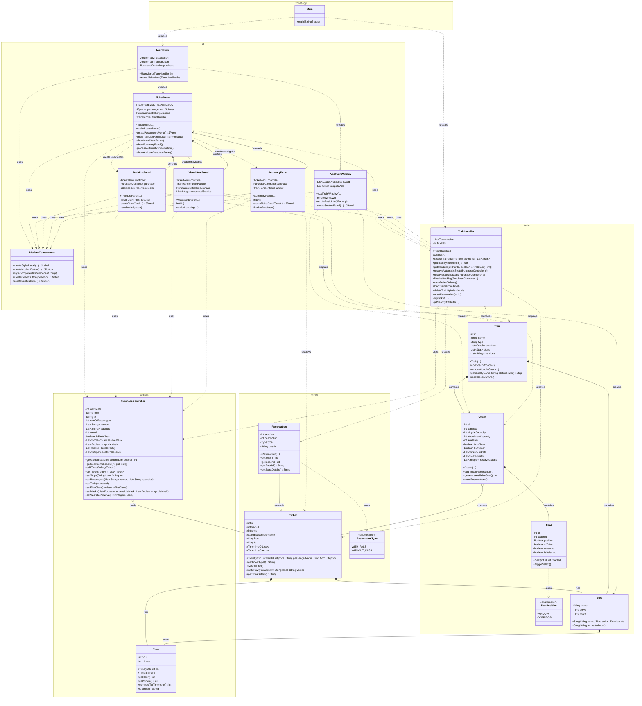
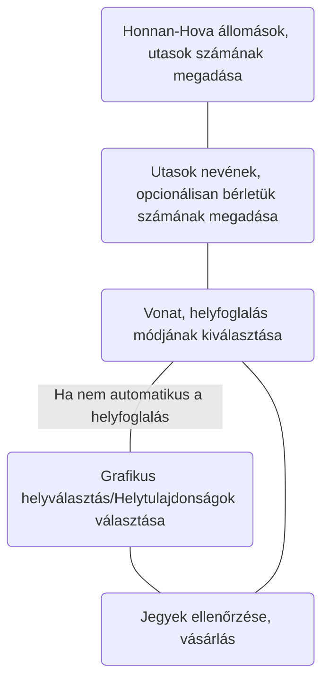

# Osztálydiagram



# Felhasználói kézikönyv

A program futtatáskor megpróbál beolvasni vonatokat egy fájlból, majd a főmenüben választhatjuk ki, hogy mit szeretnénk csinálni, jegyet venni, vagy a vonatokat kezelni (Admin panel).

## Admin panel

Ennek a menünek a fő funkcionalitása új vonat hozzáadása a meglévőkhöz. A fejlécben adhatjuk meg a vonat nevét, azonosítóját valamint típusát, amit egy legördülő menüből választhatunk ki. A vonatok azonosítója egyedi. Ezalatt, a bal oldalon kocsit, a jobb oldalon megállót adhatunk hozzá a táblázatok alatt található sávok segítségével úgy, hogy a megfelelő adatokat pontosvesszővel elválasztva beírjuk a következőképpen:
- Kocsi hozzáadása: ``` azonosító;férőhely;kerékpárhelyek;akadálymentes helyek;elsőosztály?;büfékosi? ```
	- A két utolsó paraméter értéke `1` amennyiben igaz, `0` amennyiben nem
	- Pl.: a 412-es, elsőosztályú, 20 fős, kerekesszék- és kerékpárszállításra nem alkalmas nem büfékocsit a következőképpen lehet hozzáadni: ``` 412;20;0;0;1;0 ```
- Megálló hozzáadása: ```megálló neve;indulás;érkezés```
	- Az indulási és érkezési idő formátuma: `ÓÓ:PP` 
	- Az indulási idő nem lehet korábbi, mint az érkezési idő, ezt a program ellenőrzi
A hozzáad gombra kattintás után megjelennek a kocsik/megállók a táblázatokban. Törléshez rákattintunk a törölni kívánt megálló vagy kocsi sorára, amit kék színű kijelöléssel jelez a program, majd a törö gombra kattintva törlődik a vonatból.

Ha végeztünk, a vonat mentése gombra kattintva a program elmenti a változtatásokat mind a fájlba, mint a jelenlegi munkamenethez. Lehetőség van még vonatot törölni azonosító alapján, illetve vonat "alaphelyzetbe állítására", szintén azonosító alapján. Ekkor a vonat minden helyfoglalását töröljük, "üressé tesszük" a vonatot.

## Jegyvásárlás

Itt egy menürendszeren keresztül lehet jegyet venni. Nagy vonalakban egy jegyvásárlás menete:


A vonat kiválasztásánál választhatunk, hogy első- vagy másodosztályú helyjegyet szeretnénk vásárolni, amennyiben nem személyvonatról van szó, akkor csak menetjegyeket étékesítünk. A helyet háromféleképpen lehet kiválasztani:
- **Automatikus** : A program automatikusan kisorsolja a helyeket(ha nem személyvonatról van szó) 
- **Helytulajdonság választása**: Ekkor a felhasználó a következő ablakban kiválaszthatja minden utasnak, hogy akadálymentes és/vagy kerékpárszállító kocsiba kapjanak helyet. Nem zárják ki egymást, tehát ha valaki nem kér pl. akadálymentes helyet, attól még kaphat olyan kocsiba jegyet.
- **Grafikus helyfoglalás** 
	Ekkor a következő ablakban választhat a felhasználó helyet. a felső sávban a vonat kocsijai közül választhat, természetesen csak azon osztályú kocsikból lehet csak választani, amit az előző menüben megadtunk (azaz ha a 2.soztályú jegyre nyomunk, csak a 2.osztályú kocsikat fogja megjeleníteni a menü). A képernyő közepén pedig az ülések találhatók. 
	
	- A <span style="color:rgb(46, 204, 113)">zöld</span> színű ülések azt jelentik, hogy szabad a hely, le lehet foglalni
	- A <span style="color:rgb(15, 110, 50)">sötétzöld</span> színű ülés jelenti a kiválasztott ülést
	- A <span style="color:red">piros</span> színű ülés már foglalt, oda nem lehet foglalni
	
Miután kiválasztottuk a helyeket, a program egy ellenőrző menübe dob, ahol a megvásárlásra váró jegyek tartalmát és árá tekinthetjük meg. Egy standard, menetjegy nélküli helyjegy ára 650 FT, egy menetjegy 1000 forint. Az elsőosztály felára 2-szeres minden esetben.